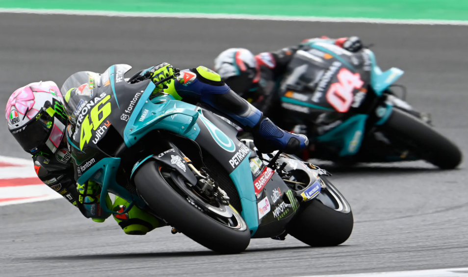

# Nsr

关于京商NSR500，1/8比例遥控摩托的资料整理

## 调车资料

| 资料 | 说明 |
|------|------|
| [两轮摩托车左右重量平衡测量](调车.md) | 使用四点称重平台测量左右载荷比例及横向重心偏移 |

## 版花贴纸

本目录包含各种摩托车队的版花贴纸设计说明及预览。

### 版花列表

| 版花 | 说明 |
|------|------|
| [Yamaha 2021 Rossi 版花](%E6%9C%89%E5%85%B3%E7%89%88%E8%8A%B1%E8%B4%B4%E7%BA%B8/Yamaha%202021%20Rossi%20%E7%89%88%E8%8A%B1.md) | 致敬猴王最后一年的 GP 生涯 |
| [Yamaha 2007 荷兰冠军拉花](%E6%9C%89%E5%85%B3%E7%89%88%E8%8A%B1%E8%B4%B4%E7%BA%B8/Yamaha%202007%20%E8%8D%B7%E5%85%B0%E5%86%A0%E5%86%9B%E6%8B%89%E8%8A%B1.md) | 罗西 2007 荷兰分站冠军版花 |
| [杜卡迪 2002 冠军贴纸](%E6%9C%89%E5%85%B3%E7%89%88%E8%8A%B1%E8%B4%B4%E7%BA%B8/%E6%9D%9C%E5%8D%A1%E8%BF%AA%202002%20%E5%86%A0%E5%86%9B%E8%B4%B4%E7%BA%B8.md) | 杜卡迪 2002 年冠军版花设计 |
