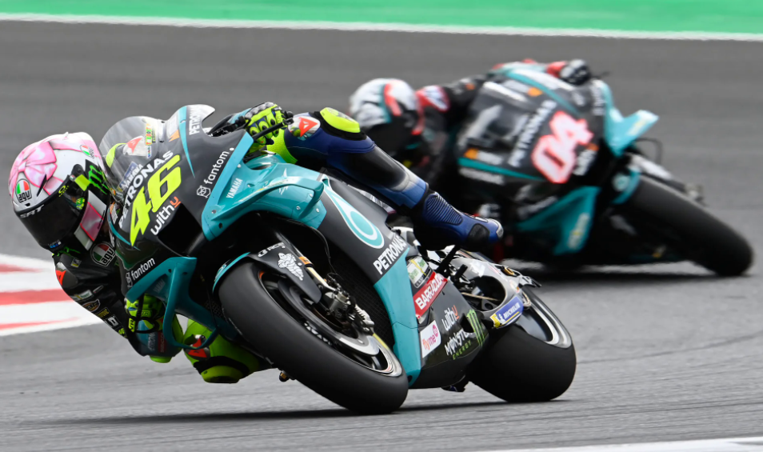

# Kyosho Nsr500 、zh 、vmoto ...

关于京商NSR500，1/8比例遥控摩托的资料整理
<small>*Information organization regarding Kyosho NSR500, a 1/8 scale RC motorcycle.*</small>

## 调车资料
<small>*Tuning and Measurement Setup*</small>

| 资料  <small>*Document*</small> | 说明  <small>*Description*</small> |
|------|------|
| [两轮摩托车左右重量平衡测量](调车.md) | 使用四点称重平台测量左右载荷比例及横向重心偏移  <small>*Measuring left-right load ratio and lateral center of gravity using a 4-point weighing platform.*</small> |

## 版花贴纸
<small>*Livery Decals*</small>

本目录包含各种摩托车队的版花贴纸设计说明及预览。
<small>*This directory contains description manuals and previews for various motorcycle racing liveries.*</small>

### 版花与贴纸列表
<small>*Livery & Sticker Catalog*</small>

| 类别  <small>*Category*</small>           | 贴纸项目  <small>*Sticker Project*</small>                                                 | 说明  <small>*Description*</small>                                                                                          |
| ------------------------------------------ | ----------------------------------------------------------------------------------------- | ---------------------------------------------------------------------------------------------------------------------------- |
| **车身版花**  <small>*Bike Livery*</small>  | [Yamaha 2021 Rossi 版花](有关版花贴纸/Yamaha%202021%20Rossi%20版花.md)                              | 致敬猴王在雅马哈最后一年的 GP 生涯  <small>*Paying tribute to the Doctor's final MotoGP season with Yamaha.*</small>                     |
| **车身版花**  <small>*Bike Livery*</small>  | [Yamaha 2007 荷兰冠军拉花](有关版花贴纸/Yamaha%202007%20荷兰冠军拉花.md)                                    | 罗西 2007 荷兰分站冠军（小清新粉蓝菲亚特500版花）  <small>*Rossi's 2007 Dutch GP winner livery (Retro pastel Fiat 500 theme).*</small>        |
| **车身版花**  <small>*Bike Livery*</small>  | [Ducati 2022 No.63 冠军贴纸](有关版花贴纸/Ducati%202022%20No.63%20冠军贴纸.md)                          | 2022 年 Pecco Bagnaia 逆天大逆转夺冠版花设计  <small>*2022 champion Pecco Bagnaia's legendary comeback livery.*</small>               |
| **头盔贴纸**  <small>*Helmet Decal*</small> | [VR46 Rossi 罗西小乌龟贴纸](有关版花贴纸/【头盔】VR46%20Rossi%20罗西小乌龟贴纸.md)                                | 2013 年主场自嘲“太慢了”的小乌龟经典头盔贴纸  <small>*The iconic "Tartaruga" self-deprecating helmet decal from Mugello 2013.*</small>       |
| **头盔贴纸**  <small>*Helmet Decal*</small> | [2025 NO.93 Marc Marquez 冠军头盔贴纸](有关版花贴纸/【头盔】2025%20NO.93%20Marc%20Marquez%20%20冠军头盔贴纸.md) | 马奎斯 2025 年加入杜卡迪厂队首夺总冠军纪念头盔贴纸  <small>*Marc Marquez's 2025 championship victory helmet decal with factory Ducati.*</small> |

---

## 🏁 2026 MotoGP 赛季精彩看点
<small>*2026 MotoGP Season Highlights*</small>

- **马奎斯冲击最高级别第八冠** 🐜
  拿下 2025 年世界总冠军后，MM93（已续约至 2028 年）正在全力以赴冲击他的最高级别第八冠，誓要追平阿戈斯蒂尼的终极纪录。
<small>*Marc Marquez Chasing Title #8: After clinching the 2025 title, MM93 (now extended to 2028) is aiming to equal Agostini’s legendary premier-class record.*</small>

- **WSBK三冠王 Toprak 的 MotoGP 首秀** 🏍️
  世界超级摩托车锦标赛（WorldSBK）超级巨星“土耳其飞人”Toprak Razgatlıoglu 终于加盟 Pramac Yamaha，引爆全网车迷期待。
<small>*Toprak’s MotoGP Debut: The three-time WorldSBK champion Toprak Razgatlıoglu has officially joined Pramac Yamaha, generating massive hype.*</small>

- **2027 规则大洗牌的前哨战** ⚙️
  2026 年是 1000cc 引擎的最后一年。2027 年将迎来 850cc 引擎时代，同时彻底禁用高度调节装置并大幅削减空力套件。各大厂商已提前开启疯狂的“转会期内斗”。
<small>*The 2027 Technical Reset Prep: 2026 marks the final year of 1000cc machinery before switching to 850cc, banning ride-height devices, and cutting aero.*</small>

- **安全新规落地** 🦺
  为应对发车时的事故，从荷兰站起将全面禁用前部发车高度调节装置，且发车排位间距扩大至 4 米。
<small>*New Safety Rules: To prevent start-line crashes, front ride-height devices are banned starting from the Dutch GP, and grid spacing is expanded to 4 meters.*</small>

---

## 🇨🇳 新国货之光：张雪机车（ZXMOTO）资料库
<small>*The Pride of Domestic Tech: Zhang Xue Motorcycle (ZXMOTO)*</small>

- **品牌起源**
  由前凯越机车（KOVE）创始人、硬核技术狂人**张雪**于 2024 年离职后重新创立。品牌宗旨是坚持正向自主研发，制造真正能走上国际顶级赛场的高性能多缸战车。
<small>*Brand Origin: Founded by former Kove Moto visionary and engineering fanatic Zhang Xue in 2024. The brand is dedicated to independent R&D and high-performance racing machinery.*</small>

- **WSBK赛场大捷（2026年3月）** 🏆
  在 2026 年 3 月的 WSBK 葡萄牙站 WorldSSP 组别中，张雪机车旗下赛车一举斩获分站冠军，打破了日系和欧系品牌几十年的赛事垄断，国货声名鹊起！
<small>*Historic WSBK Victory (March 2026): ZXMOTO claimed a historic victory in the WorldSSP category at the Portuguese GP, breaking decades of foreign dominance.*</small>

- **旗舰引擎平台** 🚀
  - **819cc 直列三缸引擎**：张雪机车的绝对技术核心，最大马力输出可达 135-150 匹，专为 820RR 等高性能仿赛和赛道机器打造。
<small>*819cc Inline-Three: The crown jewel of ZXMOTO's powertrains, pushing out 135-150 hp for the flagship 820RR sportbike.*</small>
  - **500cc 直列四缸引擎**：中排量仿赛/街车主力，声浪高亢，动力充沛。
<small>*500cc Inline-Four: High-revving, aggressive, and melodious motor powering their mid-weight performance models.*</small>

- **硬核安全准入机制** ⚠️
  张雪机车极其注重骑士安全，官方规定：**旗舰三缸仿赛 820RR 禁止驾龄不满一年的新手购买**，实力劝退盲目买车的萌新。
<small>*Strict Safety Gatekeeping: ZXMOTO enforces a strict rule: the flagship three-cylinder 820RR is banned for novice riders with less than 1 year of experience.*</small>

---

## 🔮 下期预告：张雪机车限定版花贴纸
<small>*Next Project Teaser: Zhang Xue Motorcycle Custom Livery*</small>

下一个 NSR 遥控摩托贴纸项目，我们正在考虑制作 **张雪机车（ZXMOTO）的赛事冠军拉花**！当 1/8 比例的遥控摩托 NSR 穿上国产 WSBK 夺冠涂装，情怀与科技感直接拉满，敬请期待！
<small>*Our next NSR decal project will likely focus on **ZXMOTO's WorldSSP championship livery**! When a 1/8 scale RC NSR500 wears the champion outfit of a historic domestic racer, the combination of racing legacy and national pride will be unmatched. Stay tuned!*</small>
