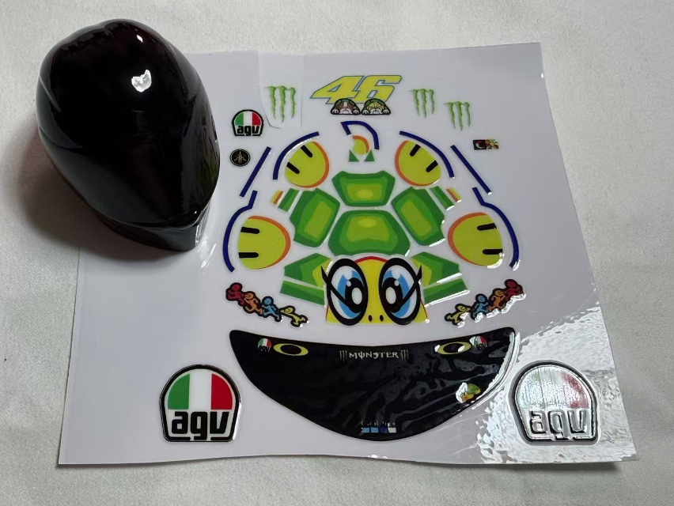
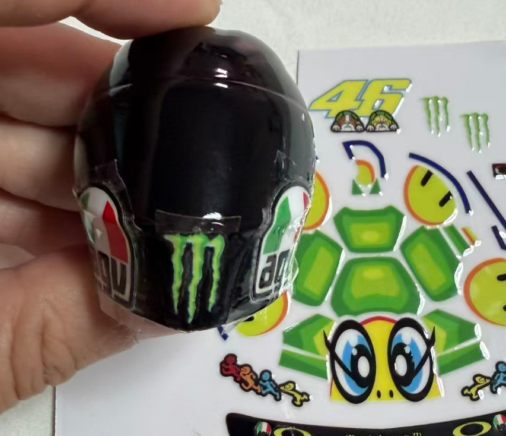
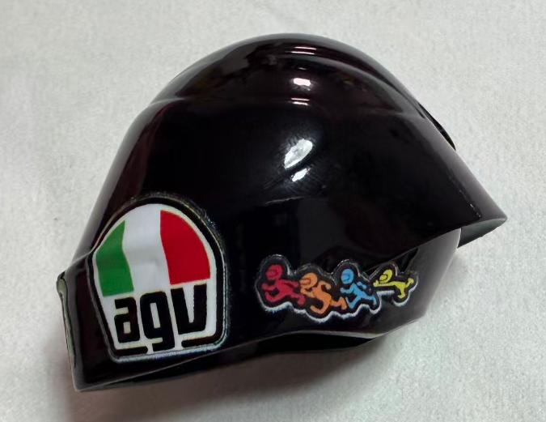
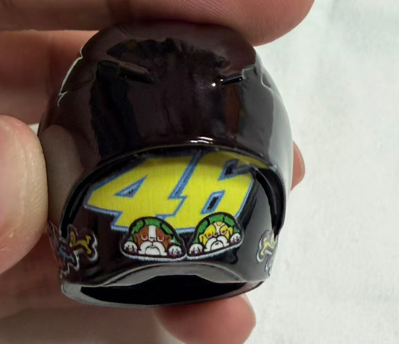
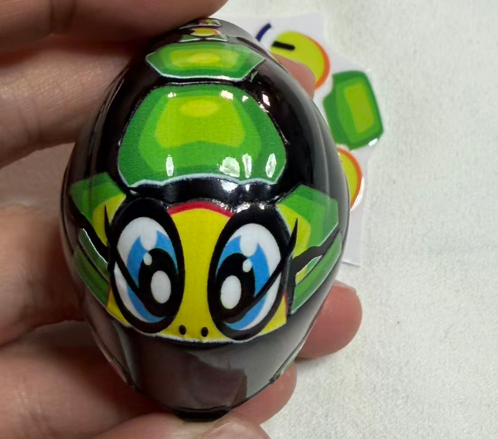
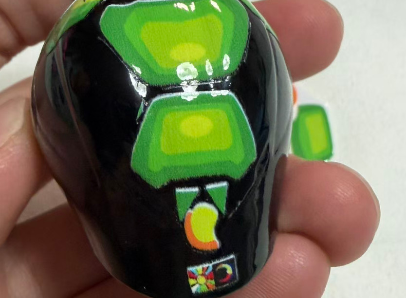
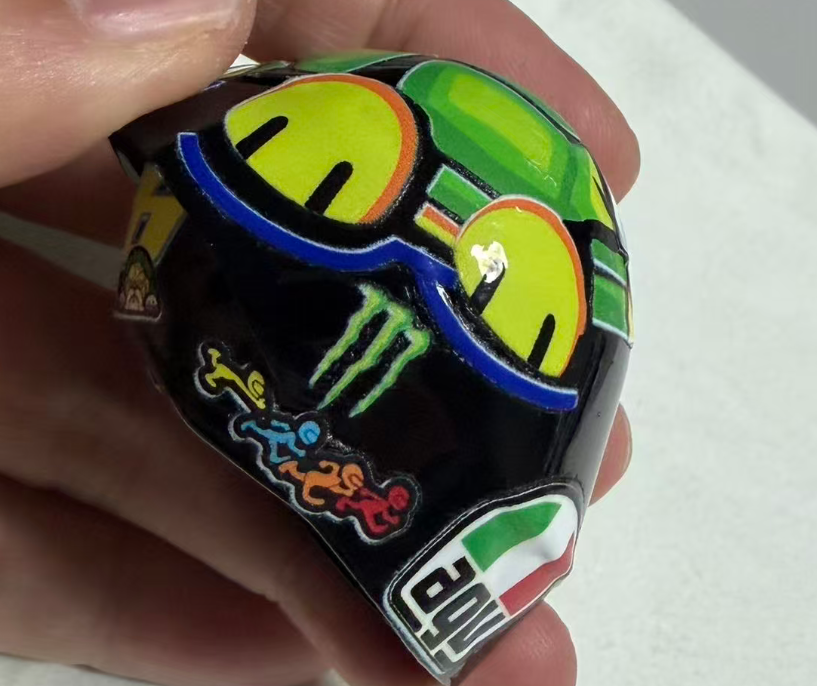
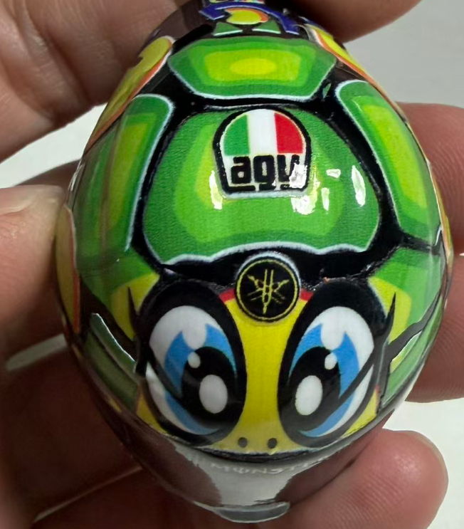
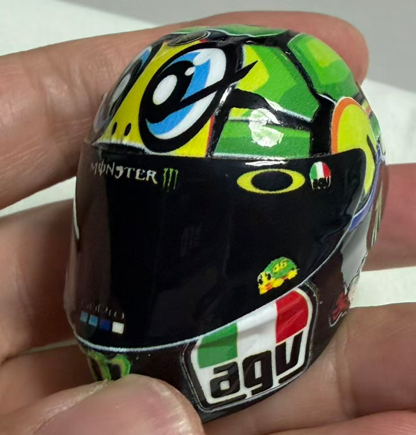
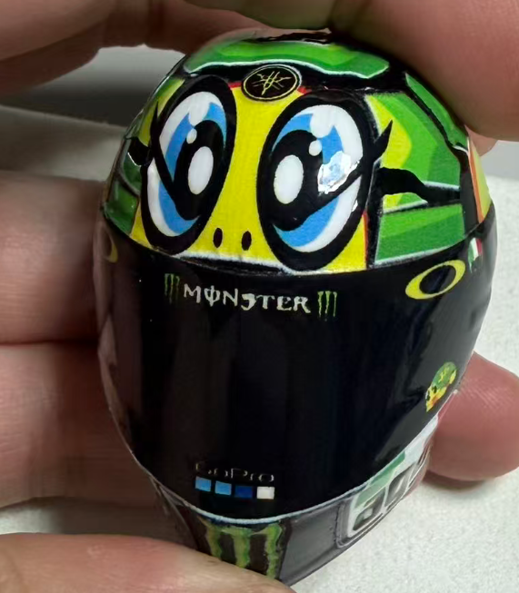

#### 1.头盔选择 闲鱼 aka370 的 预喷黑漆版本（原厂也能贴，效果差点意思）
<small>*Step 1: Helmet Selection - Go with the pre-sprayed matte black version from Xianyu seller aka370 (Stock helmet works too, but the final look is a bit... meh).*</small>

头盔+贴纸 图示如下
<small>*Helmet + stickers preview as shown below:*</small>

#### 2.先贴大的 monster 标 和两侧的 agv 标
<small>*Step 2: Slap on the giant Monster energy claws first, then the AGV decals on both sides.*</small>

图示如下
<small>*Behold the layout:*</small>

#### 3.贴agv 后面的 小人
<small>*Step 3: Stick the little mascot dude right behind the AGV logo.*</small>

图示如下 我得这个agv 有点贴歪了 应该底部 与 头盔底部 平齐
<small>*Visual guide below. By the way, my AGV decal ended up a bit crooked... Do as I say, not as I do: the bottom edge should align perfectly with the bottom of the helmet!*</small>

#### 4.贴最后的 46 标 
<small>*Step 4: Slap on the legendary #46 logo.*</small>

图示如下 我这个贴的有点靠上了 
<small>*Like this. I pasted mine a bit too high... but hey, nobody's perfect.*</small>

#### 5.贴乌龟正中间的三块 和 尾巴
<small>*Step 5: Stick the three center shell pieces and the cute little tail.*</small>

图示如下 眼睛卡在镜片区 鼻孔漏在外面 然后 顺序 贴后面的龟壳，紧凑点 整齐点，我这里就太松散了 hhh
<small>*See below: the eyes should align with the visor boundary, with the nostrils left exposed. Next, stick the rear shell pieces in order. Keep them tight and neat! Mine is way too loose—looks like the poor turtle is stretching, haha.*</small>

后面看如下 应该更紧凑些 小尾巴往前点~
<small>*Back view: it really should be tighter, and that little tail needs to nudge forward a bit!~*</small>

#### 6.贴乌龟前后爪
<small>*Step 6: Stick the turtle's front and back paws.*</small>

图示如下 应该是先贴 两个爪子中间的 装饰 然后贴 前爪 后抓 和 蓝线 ，剪掉多余的蓝线~ 然后对称的另一面也贴好。
<small>*Like this: standard procedure is to stick the decorative piece between the paws first, then the front paw, back paw, and the blue line. Snip off any excess blue line~ Then mirror the whole process on the other side.*</small>

我只是展示顺序，大家意会就好 ，**看这一侧的 agv 就是正确的**~
<small>*I'm just showing the order here, so get the general idea. **But seriously, look at the AGV logo on this side—spot on!**~*</small>

都贴好后 从上面看效果 如下
<small>*Once everything is pasted, the top view looks like this:*</small>

#### 6.ok 最后一步！贴头盔风镜
<small>*Step 7 (Wait, another step 6? Let's call it final step!): Visor sticker time!*</small>

把风镜贴在头盔风镜位置！大功告成！
<small>*Stick the visor sticker right onto the visor area! Boom, done!*</small>

我这个展示 前后贴了10分钟，其实你会发现，只要把贴纸都招呼上，效果就很惊人！~~
<small>*This showcase took me only about 10 minutes from start to finish. Honestly, you'll find that once all the stickers are slapped on, the result is absolutely jaw-dropping!~~*</small>

换个角度，惊人的效果~
<small>*Let's view it from another angle—simply majestic~*</small>

