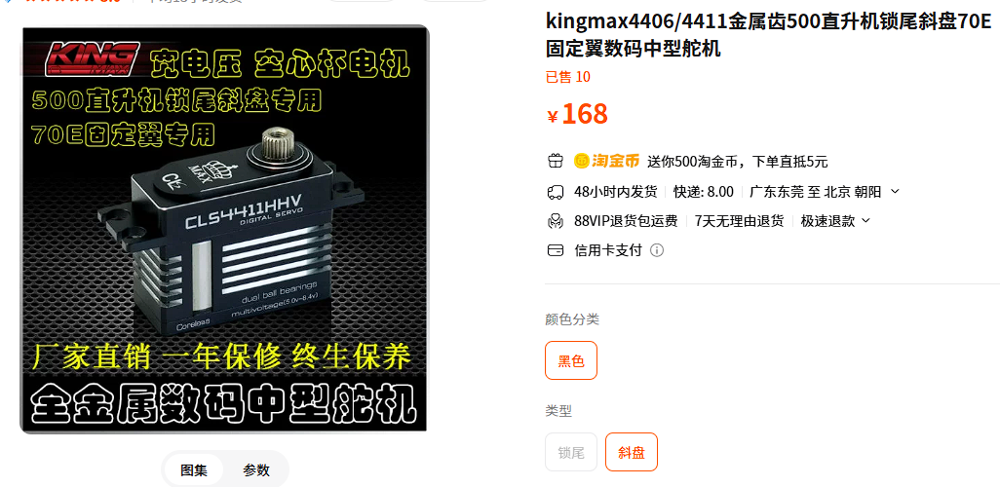
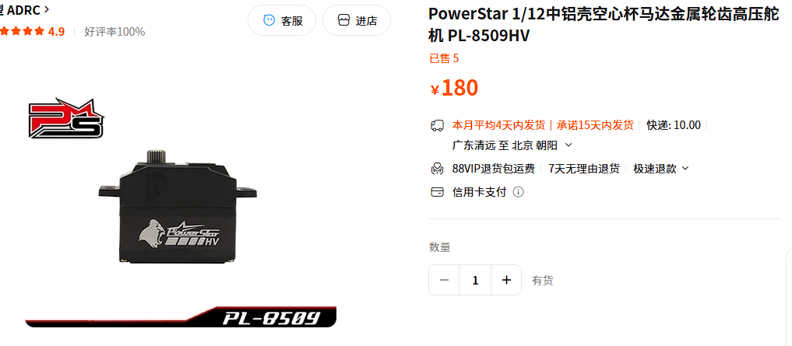
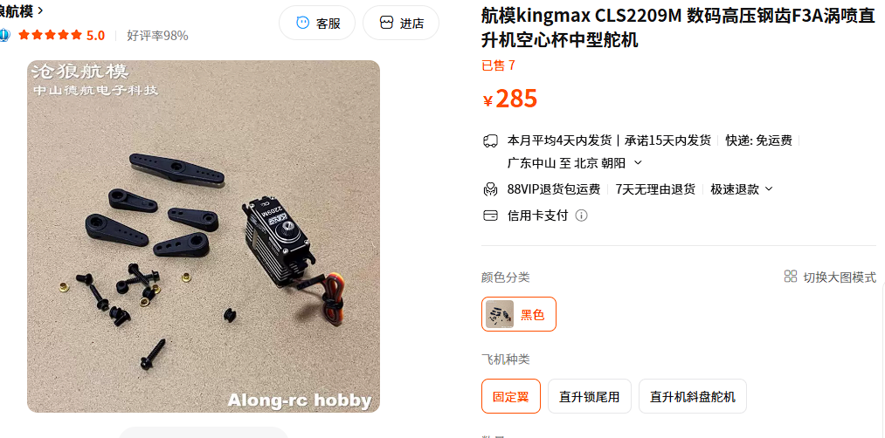
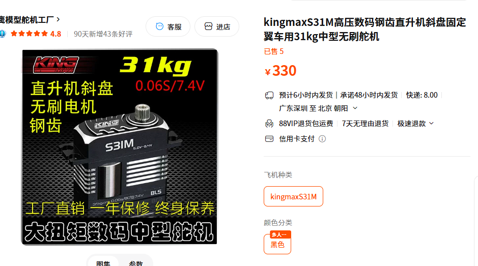

这个文章之前有在rcfan上发表过的，看时间都是三年前的事了。

于是在人类飞速发展的今天，从新梳理一下有关京商NSR500的电设选择，会按照

原厂改造和ZH等碳板车架两个方向，和经济实惠与一步到位2个分支做些推荐和说明。

我不是商家，不给谁引流，只是记录下自己的经历，如果能帮到更多的朋友那也是极好的。

## 舵机

#### 经济实惠平价之选

**kingmax4411**

优点是 很平均
缺点是 力量稍微有点小，对于自动起车的 魔法齿轮 有点压力，能用，但不够通畅！跟它差不多的

**powerstar 8509**

这俩都差不多，但4411是金属壳，装nsr要切耳朵，所以 塑料壳的8509更好下手些。都是金属齿都是空心杯，各位按需下单既可。

#### 实用之选

**kingmax 2209**

这个其实是极力推荐的，速度、力量都符合nsr的要求，自动起车无压力。
像是他们家的 S31 虽然数据上更好看，但是马达裸漏的设计 对于车架安装会有些不友好。要改造一下碳板啥的，相当麻烦。
但2209是空心杯舵机，对于很多迷恋舵机静音讨厌吱吱响的人来说不能忍，那就上S31吧。

## 电调 & 马达

## 电池
## 刹车舵机

## 遥控器