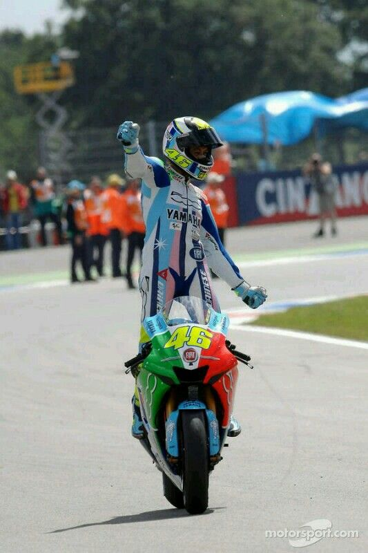
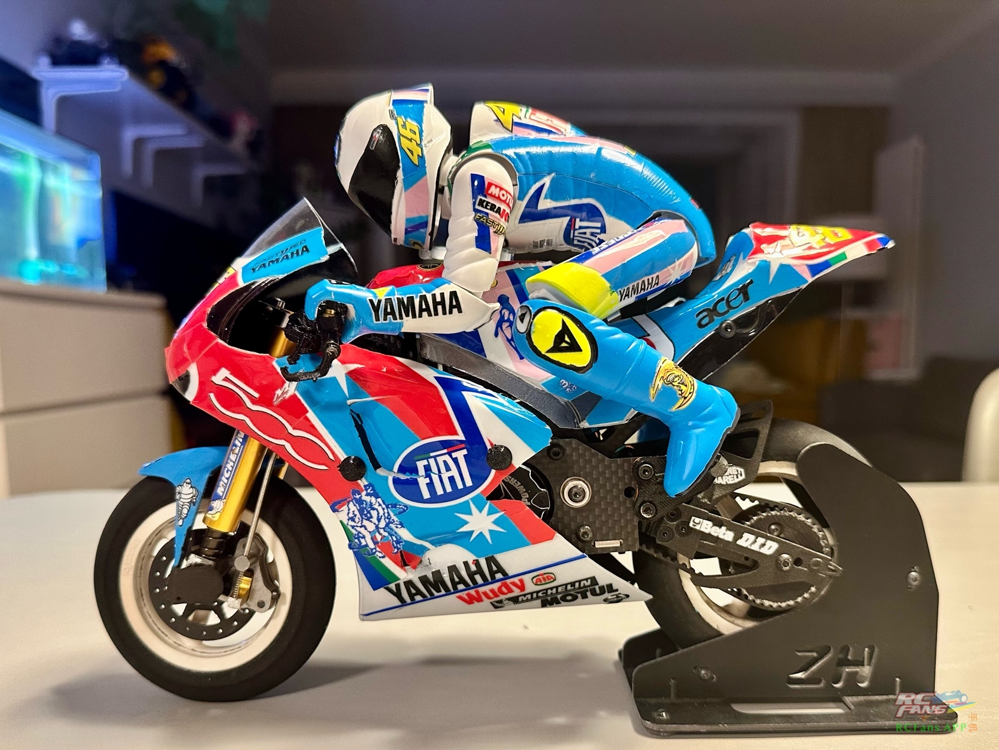
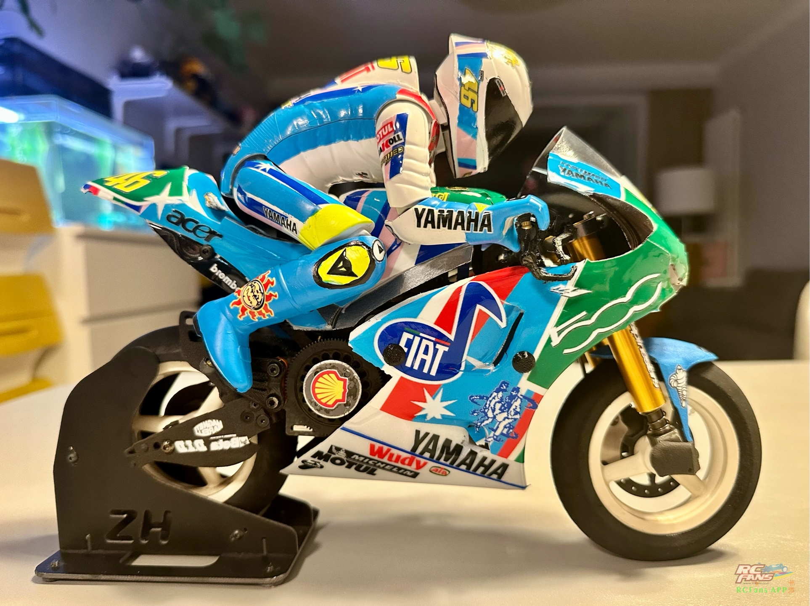
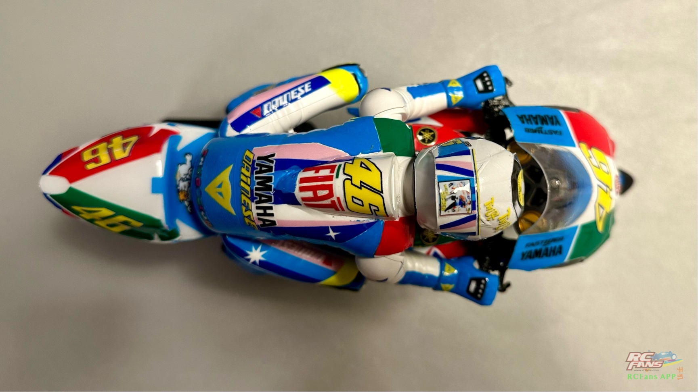

## 2024年的得意之作！ 🛠️
<small>*My Proud Work of 2024! 🛠️*</small>

不知不觉，这已经是玩 NSR 的第五个年头了（钱包表示很淦）。
<small>*Unbelievably, this is already my fifth year playing with the NSR (my wallet is crying, by the way).*</small>

罗西的雅马哈版花，尝试了另一种思路，底色 and 拉花都靠贴纸来实现…
<small>*This time, when working on Rossi's Yamaha livery, I tried a new approach: doing both the background color and the decals entirely with stickers... (Yes, the ultimate lazy sticker method).*</small>

整体效果看过去还凑合，但如果非要拿着放大镜看细节的话，那跟专业的内喷漆面比起来确实是“差点意思”。
<small>*Overall, it looks decent from afar. But if you bring out a magnifying glass to inspect the details, it definitely falls short compared to a professional inner-spray finish.*</small>

不过这都不是事儿——只要退后两米看，它就是完美的！心中有爱，瑕疵拜拜！
<small>*But hey, that's not a problem at all—as long as I stand two meters away, it looks absolutely flawless! With enough love in your heart, every defect disappears!*</small>

罗西的2007年 荷兰分站赛冠军车 版花
<small>*This livery pays tribute to the special limited edition design Rossi used during his championship-winning race at the 2007 Dutch GP.*</small>

---

## 🏁 罗西 2007 年荷兰站冷知识 (Trivia Time!)
<small>*Let's take a trip down memory lane. This race and livery are absolute legendary moments in MotoGP history:*</small>

- **菲亚特500五十岁生日派对** 🚗
  这套版花是雅马哈车队为了庆祝意大利国民神车“菲亚特 500 (Fiat 500)”诞生 50 周年（1957-2007）而特别定制的。
<small>Fiat 500 Birthday Bash: This custom livery was a special collaboration by Yamaha to celebrate the 50th anniversary of Italy's most beloved retro car, the Fiat 500 (originally launched in 1957).</small>

- **猛男专属的粉蓝小清新** 🎸
  由罗西的专属设计师 Aldo Drudi 亲自操刀，整车采用了极其罕见的复古粉色和粉蓝色调。车身上还印有黑胶唱片、猫王 Elvis Presley 的致敬元素，甚至还有罗西抱着吉他的卡通形象——自称为“瓦伦蒂诺与吉娃娃乐队”。猛男骑车，粉嫩一点怎么了！
<small>*Pastel Pink Blue for Real Men: Penned by Rossi's legendary helmet designer Aldo Drudi, the bike featured pastel pink and baby blue—highly unusual for a MotoGP beast. It had vinyl records, Elvis Presley motifs, and a caricature of Rossi holding a guitar, dubbed "Valentino and the Chihuahuas." Because real men ride pink bikes, obviously.*</small>

- **第11名起步的逆天大翻盘** 🏆
  排位赛罗西发挥失常，只拿到了**第 11 位**起步。结果正赛开始后猴王一路开挂，疯狂超车，并在距离终点仅剩 3 圈时，在最后一个减速弯极限超越了 Casey Stoner，夺得冠军！这场“第 11 变第 1”的战役直接封神。
<small>*11th-to-1st Masterclass: Rossi messed up qualifying and started way back in 11th place. But when the lights went out, the Doctor activated god mode, sliced through the field, and overtook Casey Stoner at the final chicane with only 3 laps remaining to take the win! A legendary comeback.*</small>

- **绝版理财神器头盔** ⛑️
  由于这场比赛太具传奇色彩，AGV 后来将当场比赛的头盔图案加入了“Rossi 历史头盔 (I Caschi di Vale)”复刻系列，全球限量 2007 顶，现在已经是摩托车迷眼中的理财产品了。
<small>*The Ultimate Financial Investment: Because this race was so epic, AGV re-released the specific helmet design as part of the "I Caschi di Vale" series, limited to 2,007 units worldwide. It is now a prized collector's item.*</small>
